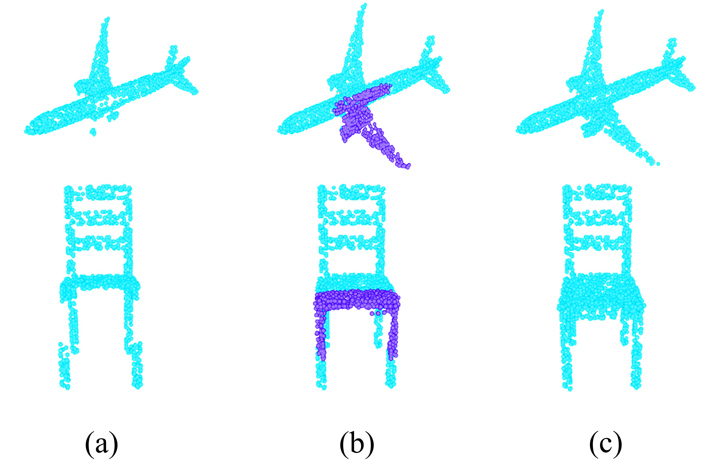

# Point-Cloud
Some method of processing point cloud

# inversion the completion pointcloud to incomplete point cloud

Some model of encoding point cloud to features

## GCN edge convolution

##Point Transformer 

##sima-attention 

##Transformer-based Network for Point Cloud Completion 

Created by [Lei Tan](https://Hello-hubKing.github.io/),Xiuyang Zhao\* et.a

